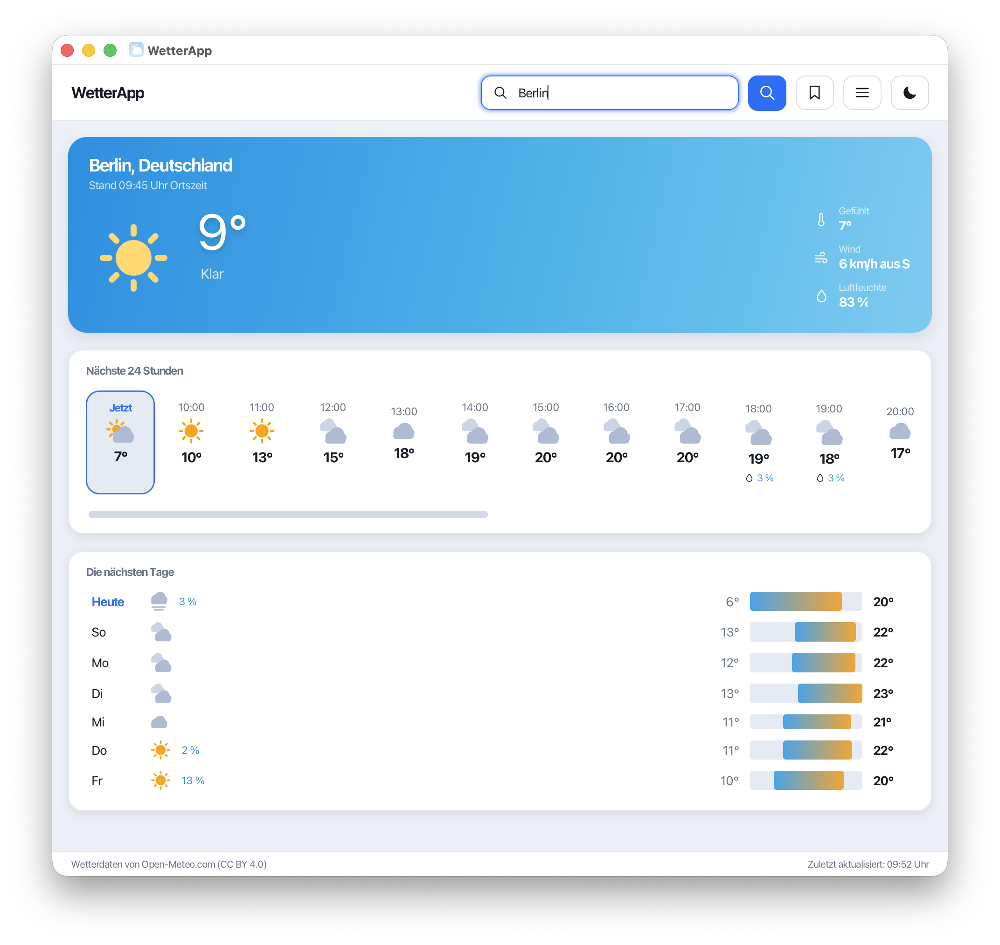
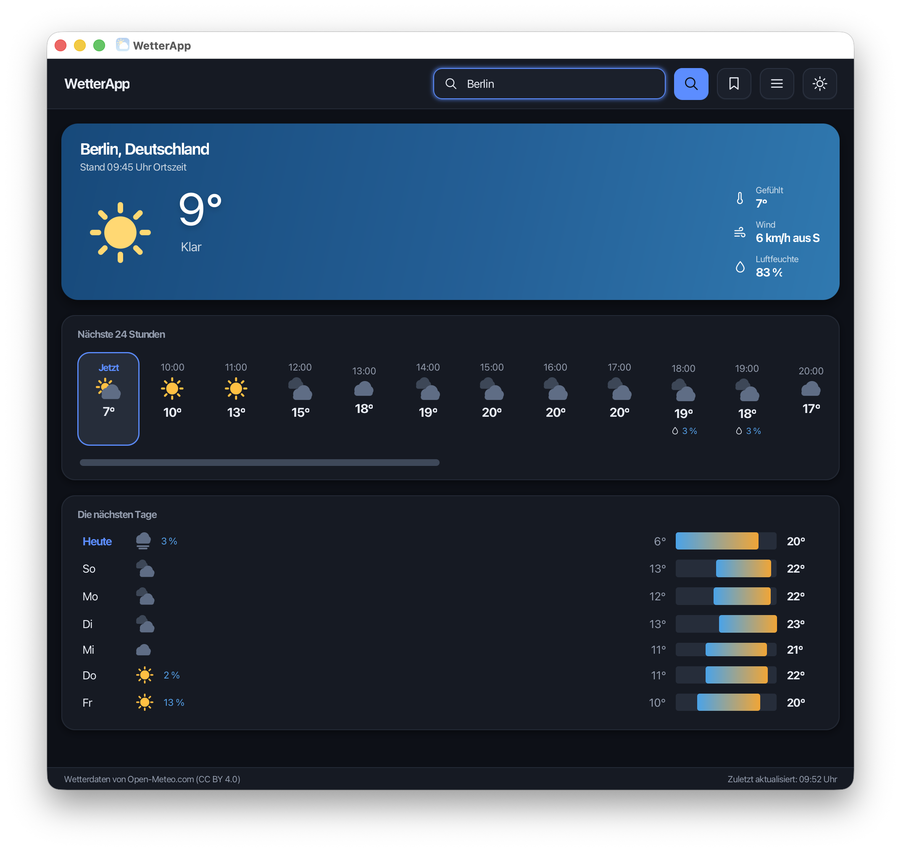
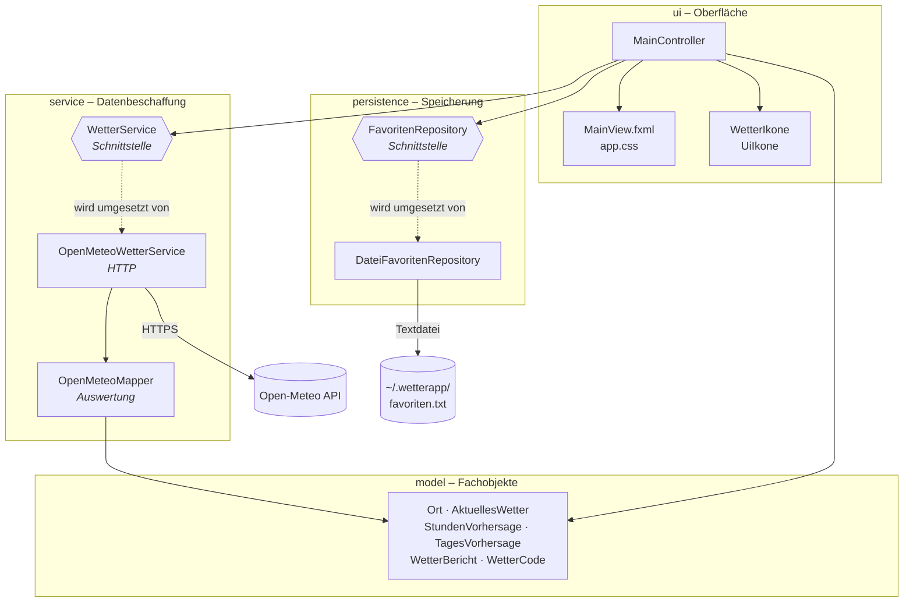

<div align="center">


# WetterApp

**Desktop-Wetteranwendung in Java und JavaFX**

Aktuelles Wetter, 24-Stunden-Verlauf und 7-Tage-Vorhersage für jeden Ort weltweit –
mit hellem und dunklem Design, selbst gezeichneten Vektorsymbolen und ohne API-Schlüssel.

[](https://github.com/felixgeorgi0304-commits/wetterapp/actions/workflows/build.yml)


</div>

---

## Screenshots

| Helles Design | Dunkles Design |
|:--:|:--:|
|  |  |

---

## Funktionen

- **Ortssuche weltweit** über den Geocoding-Dienst von Open-Meteo – auch mit Umlauten und mehrteiligen Ortsnamen
- **Aktuelle Lage** mit Temperatur, gefühlter Temperatur, Windgeschwindigkeit samt Himmelsrichtung und Luftfeuchte
- **24-Stunden-Verlauf** ab der laufenden Stunde, mit Niederschlagswahrscheinlichkeit je Stunde
- **7-Tage-Vorhersage** mit Spannenbalken, der Tief- und Hochwerte jedes Tages im Verhältnis zur ganzen Woche zeigt
- **Favoriten**, die dauerhaft im Benutzerverzeichnis gespeichert werden; der zuletzt gemerkte Ort wird beim Start geladen
- **Helles und dunkles Design**, per Knopfdruck umschaltbar
- **Tag- und Nachtsymbole**: Bei Dunkelheit am jeweiligen Ort erscheint der Mond statt der Sonne
- **Wetterabhängiger Farbverlauf** der Hauptkarte – klarer Himmel, Regen, Gewitter und Nacht sehen unterschiedlich aus
- **Keine Registrierung, kein API-Schlüssel**: klonen, bauen, starten

---

## Schnellstart

Vorausgesetzt werden ein **JDK 21 oder neuer** und **Maven 3.9+**.

```bash
git clone https://github.com/felixgeorgi0304-commits/wetterapp.git
cd wetterapp
mvn javafx:run
```

Tests ausführen:

```bash
mvn test
```

Ausführbares Paket samt passender Java-Laufzeitumgebung erzeugen:

```bash
mvn javafx:jlink
```

JavaFX wird als gewöhnliche Maven-Abhängigkeit geladen; ein separates SDK muss
nicht installiert werden.

---

## Architektur

Die Anwendung ist in vier Schichten aufgeteilt. Jede Schicht kennt nur die
jeweils darunterliegende, und zwar ausschließlich über Schnittstellen.



**Warum diese Aufteilung?**

- `MainController` bekommt `WetterService` und `FavoritenRepository` im
  Konstruktor übergeben und erzeugt sie nicht selbst. Die Datenquelle lässt
  sich dadurch austauschen, ohne die Oberfläche anzufassen.
- `OpenMeteoMapper` enthält die gesamte Auswertungslogik und keinen einzigen
  Netzwerkaufruf. Genau deshalb ist sie vollständig mit festen Beispieldaten
  testbar, ohne Internetverbindung.
- Die Modellklassen sind `record`s und damit unveränderlich. Sie können
  gefahrlos vom Hintergrund-Thread an den Oberflächen-Thread übergeben werden.

### Nebenläufigkeit

JavaFX zeichnet die gesamte Oberfläche in einem einzigen Thread. Wartet dieser
auf eine Netzwerkantwort, friert das Fenster ein. Jede Abfrage läuft deshalb in
einem `javafx.concurrent.Task` auf einem eigenen Hintergrund-Thread; nur das
Ergebnis wird über `setOnSucceeded` wieder im Oberflächen-Thread zugestellt.
Startet der Benutzer eine neue Suche, während die alte noch läuft, wird die
alte abgebrochen – sonst könnte die langsamere Antwort die schnellere
überschreiben.

---

## Projektaufbau

```
src/
├── main/
│   ├── java/
│   │   ├── module-info.java
│   │   └── de/felixgeorgi/wetterapp/
│   │       ├── WetterApp.java              Einstiegspunkt, setzt die Bausteine zusammen
│   │       ├── model/                      Fachobjekte (records) und WMO-Wettercodes
│   │       ├── service/                    Ortssuche und Vorhersage
│   │       │   └── dto/                    Abbild der JSON-Antworten
│   │       ├── persistence/                Speicherung der Favoriten
│   │       └── ui/                         Controller, Bausteine, Vektorsymbole
│   └── resources/de/felixgeorgi/wetterapp/
│       ├── view/MainView.fxml              Aufbau der Oberfläche
│       ├── css/app.css                     Farbschemata, Abstände, Symbolfarben
│       └── icons/app-icon.png              Fenstersymbol
└── test/
    ├── java/                               JUnit-5-Tests
    └── resources/fixtures/                 feste API-Antworten für die Tests
```

---

## Tests

Die Tests laufen ohne Netzwerkzugriff gegen feste Beispielantworten unter
`src/test/resources/fixtures`. Das hat zwei Gründe: Eine echte Abfrage würde
jeden Tag andere Werte liefern, gegen die sich nichts prüfen ließe, und der
Bauserver hat nicht zwangsläufig Zugang zur API.

Geprüft werden unter anderem:

| Bereich | Beispiele |
|---|---|
| `OpenMeteoMapper` | Zuschnitt des Stundenverlaufs auf die laufende Stunde, Umgang mit fehlenden Einzelwerten, leere Trefferliste bei der Ortssuche |
| `WetterCode` | Zuordnung aller WMO-Codes zu Symbolen, Eindeutigkeit der Codes, Rückfallwert bei unbekannten Codes |
| `DateiFavoritenRepository` | Reihenfolge, Duplikatschutz, Groß-/Kleinschreibung, Umlaute in UTF-8, Verhalten beim ersten Start |
| Modellklassen | Prüfung der Koordinaten, widersprüchliche Temperaturen, Unveränderlichkeit der Listen |
| `Formatierung` | kaufmännisches Runden, deutsches Dezimalkomma, Beschriftung der laufenden Stunde |

---

## Vektorsymbole statt Bilddateien

Sämtliche Wetter- und Bediensymbole werden zur Laufzeit aus Grundformen
gezeichnet (`WetterIkone`, `UiIkone`) statt als PNG mitgeliefert. Der Aufbau
erfolgt auf einem gedachten Raster von 24 × 24 Einheiten, das beim Erzeugen auf
die gewünschte Größe umgerechnet wird.

Das bringt drei Vorteile:

1. Die Symbole bleiben in jeder Größe scharf, auch auf hochauflösenden Bildschirmen.
2. Ihre Farben kommen aus dem Stylesheet und wechseln automatisch mit dem Design.
   Eine PNG-Datei mit schwarzem Umriss wäre im dunklen Design unsichtbar.
3. Tag und Nacht teilen sich dieselbe Zeichnung – nur Sonne und Mond werden
   getauscht, statt den Bildbestand zu verdoppeln.

---

## Version 2: Was sich gegenüber dem ersten Entwurf geändert hat

Dieses Projekt entstand ursprünglich als Beleg im zweiten Semester. Die
folgende Überarbeitung war der eigentliche Lerngewinn – hier steht, was vorher
nicht gut war und warum.

| Thema | Vorher | Jetzt |
|---|---|---|
| **API-Schlüssel** | Als Konstante im Quelltext, damit in jeder Kopie des Projekts lesbar | Open-Meteo braucht keinen Schlüssel; es gibt kein Geheimnis mehr, das auslaufen könnte |
| **Nebenläufigkeit** | Netzwerkabfrage im Oberflächen-Thread – das Fenster fror bei jeder Suche ein | Abfragen laufen in `Task`s im Hintergrund, mit Ladeanzeige und Abbruch der vorherigen Abfrage |
| **Fehlerbehandlung** | `printStackTrace()` und `return null`; ein Tippfehler im Ortsnamen führte zur `NullPointerException` | Eigene Ausnahmetypen, die der Controller in verständliche Meldungen übersetzt |
| **Datenfluss** | Werte wanderten als `Map<String,Object>` und als formatierter Text durch das Programm; die Wetterkennung war hinten an eine Zeichenkette gehängt (`"… \|id:500"`) und wurde in der Oberfläche wieder herausgeschnitten | Typisierte `record`s vom Abruf bis zur Anzeige; formatiert wird erst unmittelbar vor der Ausgabe |
| **Wettercodes** | Kette von `if`-Abfragen über Zahlenbereiche | Aufzählung `WetterCode`, die Code, Beschreibung und Symbol zusammenhält |
| **Tageshöchstwert** | Suche begann bei `Double.MIN_VALUE` – das ist die kleinste *positive* Zahl. An Frosttagen wurde dadurch etwa 0 °C als Höchstwert angezeigt | Die Werte kommen direkt von der API; ein Test sichert den Frostfall ab |
| **Favoriten** | Datei im Arbeitsverzeichnis, Kodierung vom Betriebssystem abhängig, jeder Klick hängte den Ort erneut an | Datei im Benutzerverzeichnis, ausdrücklich UTF-8, Duplikatschutz, Liste in einer Seitenleiste statt im Extrafenster |
| **Ortsnamen** | Nur Leerzeichen wurden ersetzt; Umlaute führten zu fehlerhaften Anfragen | Vollständige URL-Kodierung |
| **Ressourcen** | Die FXML-Datei verwies auf Bilder im Ausgabeverzeichnis `bin/` – außerhalb von Eclipse fehlten sie | Vektorsymbole im Quelltext, Ressourcen im Standard-Maven-Layout |
| **Bauen** | Nur über die Eclipse-Projektdateien, JAR im Projekt abgelegt | Maven-Projekt, das auf jedem Rechner mit einem Befehl baut |
| **Tests** | Eine Klasse `Tester` mit `main`-Methode, deren Ausgabe man von Hand lesen musste | JUnit-5-Tests, die bei jedem Push automatisch laufen |

---

## Verwendete Technik

| | |
|---|---|
| Sprache | Java 21 (`record`, `switch`-Ausdrücke, Java Platform Module System) |
| Oberfläche | JavaFX 21 mit FXML und CSS |
| HTTP | `java.net.http.HttpClient` aus dem JDK |
| JSON | Jackson Databind |
| Tests | JUnit 5 (Jupiter), parametrisierte und verschachtelte Tests |
| Build | Maven, `javafx-maven-plugin` |
| CI | GitHub Actions |
| Daten | [Open-Meteo](https://open-meteo.com) (CC BY 4.0) |

---

## Lizenz

[MIT](LICENSE) · © Felix Georgi

Wetterdaten von [Open-Meteo.com](https://open-meteo.com), veröffentlicht unter
[CC BY 4.0](https://creativecommons.org/licenses/by/4.0/).
